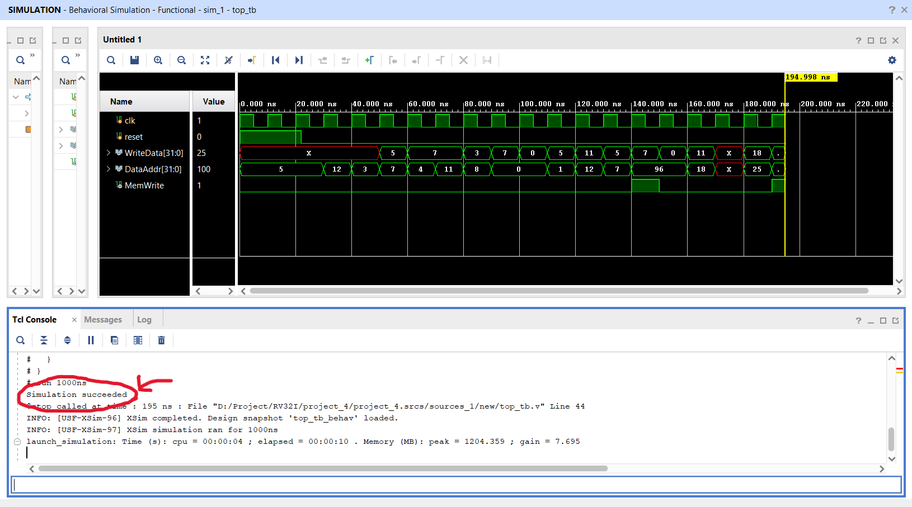

# RISC-V Processor Implementation in Verilog (Single-Cycle & Pipelined)

This repository contains Verilog implementations of two RISC-V processor architectures based on the book  
**"Digital Design and Computer Architecture: RISC-V Edition"** by *Sarah Harris and David Harris*.

The project includes:
- A fully functional **Single-Cycle** RISC-V processor
- A designed but yet-to-be-simulated **5-Stage Pipelined** processor

---

---

## ✅ Single-Cycle Processor

### ✅ Status: **Completed and Simulated**

- Implements the RV32I base instruction set
- Includes:
  - ALU
  - Register file
  - Control logic
  - Instruction & Data memory
  - Immediate generator
  - Branch logic
- Simulation done using Verilog testbench on **Xilinx Vivado**
- Output waveforms generated and verified

### 🔧 Files:
- `cpu.v` – Top module
- `alu.v`, `regfile.v`, `control.v`, `imm_gen.v`, `branch.v` – Submodules
- `mem.v`, `inst_mem.v` – Memory modules
- `tb_cpu.v` – Testbench

---

## 5-Stage Pipelined Processor

### Status: **Design Completed, Simulation Pending**

- Implements classic 5-stage pipeline:
  - IF → ID → EX → MEM → WB
- Includes:
  - Pipeline registers
  - Hazard detection unit (planned)
  - Forwarding unit (planned)
- Modular design prepared for simulation

> Simulation and verification will be added in future commits.

---

## 🛠️ Tools Used

- **Verilog HDL**
- **Xilinx Vivado** for synthesis and simulation
- **GTKWave** (optional) for waveform viewing
- **RISC-V Assembly** for test programs

---

## 📈 Sample Outputs (from Single-Cycle Simulation)

---

## 🧩 Future Enhancements

- [ ] Simulate and verify the pipelined processor
- [ ] Add forwarding and hazard detection logic
- [ ] Integrate instruction set tests (e.g., using RISC-V toolchain)
- [ ] Add support for more instructions (e.g., `ECALL`, `EBREAK`, etc.)
- [ ] Implement memory-mapped I/O or UART for simple peripherals

---

## 🤝 Acknowledgements

- This project is heavily inspired by the structure and examples from  
  *"Digital Design and Computer Architecture: RISC-V Edition"*
- Special thanks to the open-source Verilog community

---

## 📘 Reference
> Harris, Sarah, and David Harris.  
> **Digital Design and Computer Architecture: RISC-V Edition**  
> ISBN: 9780128200643

This project closely follows the architecture, datapath, and control flow outlined in the above textbook.

---

## 📜 License

This project is open-source under the [MIT License](LICENSE).

